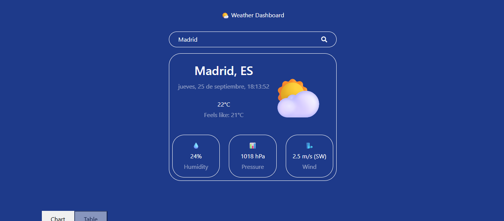
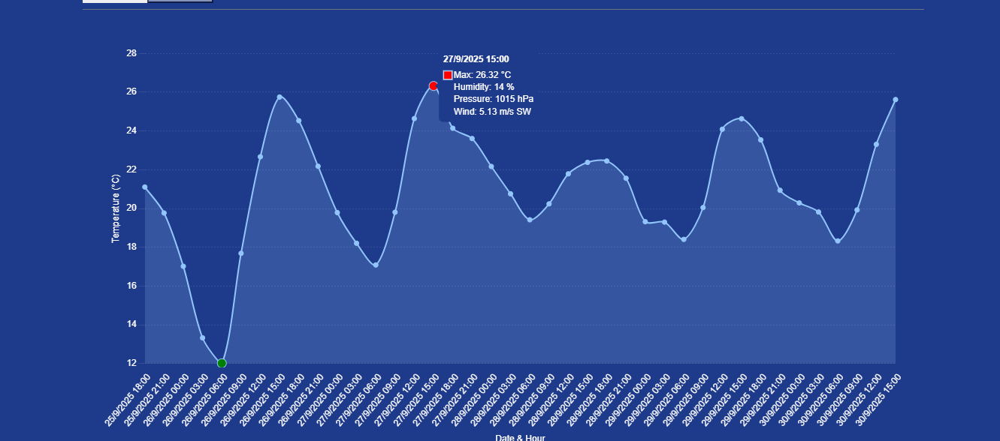
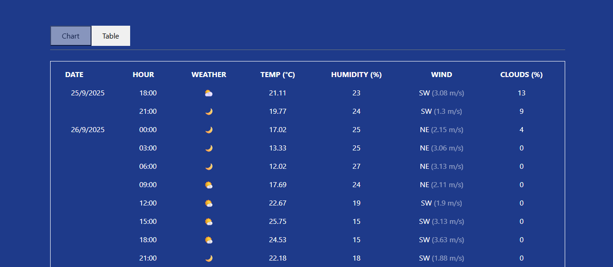

# 🌤️ Weather Dashboard


**Weather Dashboard** is a full-stack application for collecting, storing, and visualizing real-time and historical weather data.

Built with FastAPI, PostgreSQL, and Docker on the backend, and a modern React + Vite frontend. It integrates with the OpenWeatherMap API and supports automated data collection via background jobs.

---

<p align="center">
  
</p>

---

## Table of Contents
- [Features](#-features)
  - [Planned Features](#planned-features)
- [Project Structure](#project-structure)
- [Requirements](#requirements)
- [Installation](#installation)
  - [Backend](#backend)
  - [Frontend](#frontend)
- [Usage](#usage)
- [Running Tests](#running-tests)
- [API Endpoints](#api-endpoints)
- [Background Jobs (Scheduler)](#background-jobs-scheduler)
- [Frontend Screenshots](#frontend-screenshots)
- [Roadmap](#roadmap)
- [Contributing](#contributing)
- [License](#license)
- [Disclaimer](#disclaimer)

---

## Features

- 🔄 Fetch current weather from OpenWeatherMap API
- 🗃️ Store validated weather data in PostgreSQL
- 📈 Query historical records with pagination and filtering
- 📊 Daily summaries (min/max/avg) instead of hourly breakdowns
- 🕒 Automated hourly data collection via scheduler
- 🌍 Geolocation-based city detection
- 🧪 Unit tests with SQLite + API mocks
- 🐳 Dockerized for easy deploymen

### Planned Features

- 📉 Data analysis and predictive weather modeling
- 🔔 Smart weather alerts and anomaly detection
- 📅 Flexible time aggregation (weekly, monthly trends)

---

## Project Structure

### Backend

```
weather-dashboard/
├── app/
│ ├── main.py 
│ ├── models.py 
│ ├── schemas.py 
│ ├── crud.py
│ ├── db.py 
│ ├── weather_client.py 
│ ├── exceptions.py 
│ |── error_handlers.py 
| ├── routers
│ │ └── weather.py
| ├── services
│ │ └── openweather_adapter.py
│ │ └── openweather.py
│ │ └── weather_service.py
├── db/
│ └── init.sql 
├── tests/
│ ├── test_crud.py
│ ├── test_validation.py
│ ├── test_weather_client.py
│ ├── test_main.py
│ └── conftest.py
├── Dockerfile 
├── docker-compose.yml 
├── requirements.txt
├── .env.example
└── README.md
```

### Frontend

```
frontend/
├── public/
├── src/
│ ├── components/
│ │ ├── Header.jsx
│ │ ├── HistoryTable.jsx
│ │ ├── SearchBar.jsx
│ │ ├── WeatherSummary.jsx
│ │ |── TemperatureChart.jsx
│ │ └── TemperatureHistory.jsx
| ├── services/
│ │ └── api.js
| ├── utils/
│ │ ├── data.js
│ │ |── icons.js
│ │ └── weatherHelpers.js
│ ├── App.jsx
│ ├── main.jsx
│ ├── index.css
│ ├── App.css
│ └── index.js
├── package.json
└── README.md
```

---

## Requirements

- **Python 3.11+** 
- **Node.js 18+**
- **Docker & Docker Compose**  
- External weather API: **OpenWeatherMap** (required in .env)

---

## Installation

### Backend

```bash
git clone https://github.com/SeleneGonzalezCurbelo/weather-dashboard.git
cd weather-dashboard/backend
cp .env.example .env
# Fill in your DB credentials and API key
docker-compose up --build
```

Access backend:
- [API Docs](http://localhost:8000/docs)
- [Health check](http://localhost:8000/)

### Frontend

```bash
cd frontend
npm install
npm start
```

App runs at: http://localhost:5173/

---

## Usage
- Search for cities to get current weather
- View temperature charts and historical tables
- Automated scheduler fetches hourly weather data
- Use API endpoints to fetch and save data programmatically

---

## Running Tests

```bash
pytest
```

- Uses SQLite in-memory database
- Mocks external API calls
- Tests CRUD, validation, API client, and endpoints

---

## API Endpoints

| Method | Endpoint                        | Description                                            |
| ------ | ------------------------------- | ------------------------------------------------------ |
| `GET`  | `/`                             | Health check — backend running                         |
| `GET`  | `/weather/{city}`               | Fetch current weather from external API                |
| `POST` | `/weather/save/{city}`          | Fetch current weather and save to DB                   |
| `GET`  | `/weather/history`              | List all saved weather records (paginated)             |
| `GET`  | `/weather/history/{city}`       | List saved records for a specific city (paginated)     |
| `GET`  | `/weather/daily-summary/{city}` | Compute daily summary (min/max/avg) metrics for a city |
| `GET`  | `/weather/latest/{city}`        | Retrieve most recent weather record for a city         |
| `GET`  | `/weather/reverse-geocode`      | Detect city from coordinates                           |

---

## Background Jobs (Scheduler)

- Uses APScheduler to fetch weather hourly
- Configurable tracked cities and intervals
- Defined in `app/scheduler.py`

---

## Frontend Screenshots

- 🌐 Search cities and view current weather
- 📊 Temperature history chart with tooltips
- 📋 Table view with hourly breakdown
- 🧭 Wind direction, humidity, pressure, visibility
- 📍 Auto-detect location via geolocation
- 🔮 Forecast fallback if DB data is missing

### City Search + Current Weather

<p align="center">
  
</p>

### Temperature History Chart

<p align="center">
  
</p>

### Weather History Table

<p align="center">
  
</p>

---

## Roadmap

- ✅ Backend CRUD for weather data
- ✅ Scheduler to fetch weather hourly
- ✅ PostgreSQL integration
- 🔄 Frontend dashboard (React + Vite)
- 🔄 Data visualizations (charts & tables)
- 🔲 Predictive analytics & anomaly detection

---

## Contributing

We welcome contributions! Please follow these guidelines:
- Use clear commit messages (feat:, fix:, refactor:)
- Write unit tests for new features
- Follow PEP 8 (Python) and ESLint/Prettier (JS)
- Use async/await for I/O operations
- Submit PRs with a clear description and related issue reference

---

## License

This project is licensed under the MIT License. See the [LICENSE](./LICENSE) file for details.

---

## Disclaimer 

This project is for educational purposes only. The author is not responsible for misuse, errors, or third-party API limitations.

---